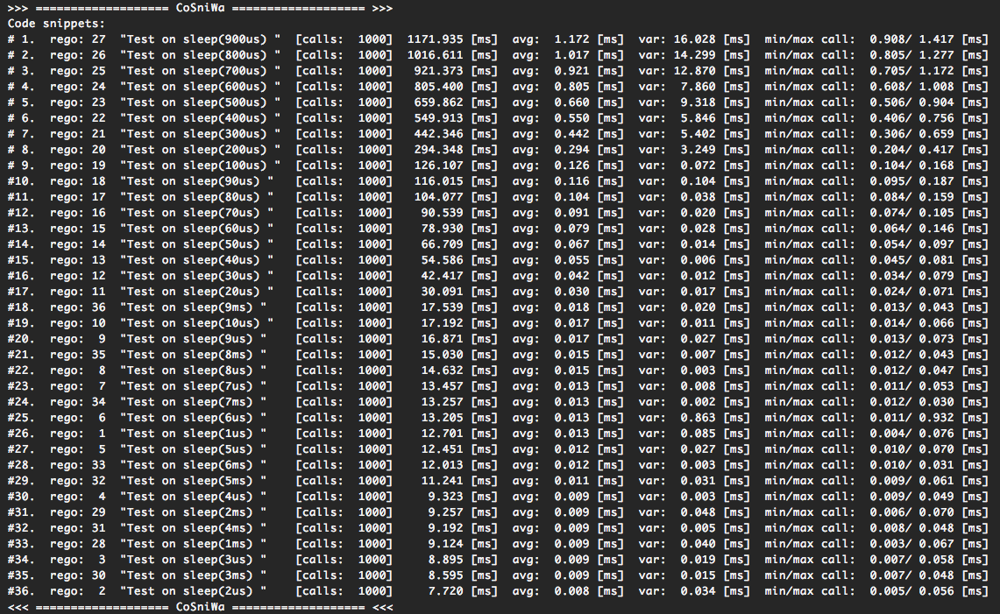

3. Case scenarios
===================================

3.1. Case1:  Test time.sleep() and usleep() functions using Cosniwa
+++++++++++++++++++++++++++++++++++++++++++++++++++++++++++++++++++++++

.. Note::

    Case1 is available on `github.com <https://github.com/jacekpierzchlewski/cosniwa>`_:
    `case1 for Python <https://github.com/jacekpierzchlewski/cosniwa/tree/master/python/examples/case1.py>`_,
    `case1 for C++ <https://github.com/jacekpierzchlewski/cosniwa/tree/master/c++/examples/case1.cpp>`_.

In the current case *Cosniwa* is used to time
functions which are suppose
to sleep for a certain amount of time.

For Python function 'time.sleep()' is tested,
for C++ function 'usleep()' is tested.

For Python run (in python/examples/):

:code:`$ python3 case1.py`

or for C++ (in c++/examples/):

:code:`$ make case1`  |br|
:code:`$ ./case1`

Results for Python:

results for C++:

It can be seen from the results above that
the sleeping functions are not
very precise.

Sleeping time is always longer than requested.
However, it can be observed that relative error between
the requested sleeping time and real sleeping time is
lower for longer requested sleeping times.

