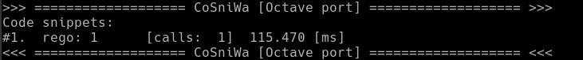
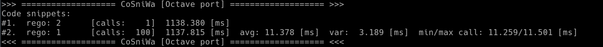
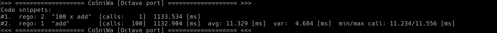
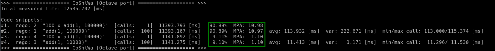
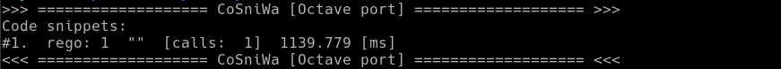
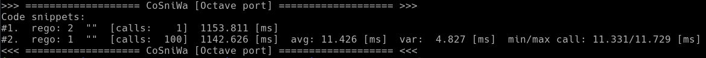
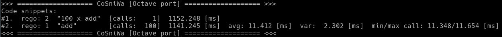
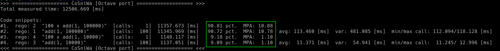

4. *Cosniwa* Tutorial for Octave
===================================

Here is a little tutorial about using *Cosniwa* with Octave.

4.0. Two versions of *Cosniwa* for Octave
++++++++++++++++++++++++++++++++++++++++++

There are two version of *Cosniwa* of Octave:
*cCosniwa* implemented in C++,
and *oCosniwa* implemented in native Octave language.
The first version, *cCosniwa*, is recommended.

*Cosniwa* implemented in native Octave language (*oCosniwa*)
should be used only if there are problems with
compilation and/or running C++ modules for Octave.

4.0.1 Compilation of *cCosniwa* for Octave
--------------------------------------------------------
To use the recommended version of *Cosniwa* for Octave, an .oct file must be
compiled.

In the main *Cosniwa* directory run:

:code:`$ make octave_cpp`

The script will compile *Cosniwa* using *mkoctfile* compiler.
This compiler is a part of Octave tool, which allows for compilation of
C, C++ and Fortran code so that it can be used by Octave.

If compilation process ends with no errors, and there is a new file
*cCosniwa.oct*
created in **octave/cpp/** directory, *cCosniwa* for Octave is ready to be used.

**Linking error.** |br|
If during compilation linker returns an error:
*"cannot find -loctinterp"* or "cannot find -loctave",
it means that a wrong directory with Octave library is given in *compile.sh*
file in **octave/cpp/** directory.
The *compile.sh* file is as follows:

.. code-block:: bash
   :emphasize-lines: 1
   :lineno-start:  1

    OCTAVELIB="/usr/lib/octave/4.2.1"
    mkoctfile -L${OCTAVELIB} cCosniwa.cpp cosniwa4Octave.cpp

To fix the problem, please locate the directory with Octave libraries *liboctave*
and *liboctinterp* in your system (usually somewhere in **/usr/lib** or **/opt/**).
Then please change the first line in *compile.sh*
so that it contains a correct directory
with Octave libraries.

4.1. Octave example1 [cOctave]: Simplest example
+++++++++++++++++++++++++++++++++++++++++++++++++

.. Warning::

   The next four examples are concerned on using *cCosniwa* (C++ implemented)
   for Octave.
   Go to examples 4.5 - 4.8 for *oCosniwa* (native Octave implementation).

.. Note::

    Example1 is available on `github.com <https://github.com/jacekpierzchlewski/cosniwa>`_:
    `example1 for Octave [cOctave] <https://github.com/JacekPierzchlewski/cosniwa/blob/master/octave/cpp/example1.m>`_.

This is the simplest example of using *Cosniwa* to time code in Octave.

**4.1.1 First things first**

File with compiled *Cosniwa* for Octave (*cCosniwa.oct*) must be present
in a directory with a .m file which uses Cosniwa.

**4.1.2 Time consuming function**

Octave examples 4.1, 4.2, 4.3 and 4.4 use the following 'add()' function
which adds two positive integer numbers in a very unoptimised way.

Function 'add()' in Octave:

.. code-block:: octave
   :emphasize-lines: 1
   :lineno-start:  18

    function add(iA, iB)
    % Add iA + iB in a slow way.

        for i = 1:iB
            iA = iA + 1;
        endfor
    end

**4.1.3 Setting up the stopwatch**

*Cosniwa*, as its name denotes, is a stopwatch for code snippets.

In this example, a single line calling 'add()' function is the code
snippet to be timed (line 21).
Function **call_start()** starts the stopwatch,
**call_stop()** stops it.

Both functions **call_start()** and **call_stop()** have the same argument:
in this case '1'.
It is a 'registration number' ('rego') of the code snippet.
Rego can be any positive number, except zero.

Finally, function **resultsc()** prints to the console the results of timing.

.. code-block:: octave
   :emphasize-lines: 1
   :lineno-start:  1

    %
    % example1.m [version 1.0]
    % CoSniWa:  COde SNIppet stopWAtch [Octave port] - Example 1.
    %
    %
    % CoSniWa is dedicated to profile code using time stamps.
    % Cosniwa  [Octave port - C++ implementation ] v1.0, 31 May 2017.
    %
    % read more on: www.speedupcode.com
    %
    % (c) Jacek Pierzchlewski, 2017  jacek@pierzchlewski.com
    % license: BSD-2-Clause.
    %

    function example1()

        % Initalise cosniwa
        cCosniwa('init');

        cCosniwa('call_start', 1);  % Start code snippet (add)
        add(1, 100000);
        cCosniwa('call_stop', 1);   % Stop code snippet (add)

       % Print the results
        cCosniwa('resultc');
    end

    function add(iA, iB)
    % Add iA + iB in a slow way.

        for i = 1:iB
            iA = iA + 1;
        endfor
    end

.. Note::
    Please note how *Cosniwa* functions are called in Octave if the compiled
    version (*cCosniwa*) is used. |br|
    |space| |space| |space| |space| |space| |space|  The first argument for *cCosniwa* module is the name of *Cosniwa* function
    (*'call_start'*, *'call_stop'*, *'resultc'*, etc.). |br|
    |space| |space| |space| |space| |space| |space|  The next argumements are arguments for the *Cosniwa* function. |br| |br|
    |space| |space| |space| |space| |space| |space| e.g.: *cCosniwa('call_start',1)*
    calls *Cosniwa* function *'call_start'* with argument '1'.

**4.1.4 Let's time!**

.. Warning::

   All the examples in this tutorial were run on Asus G752V laptop (mid 2016)
   with 2.6GHz Intel Core i7 with Gentoo Linux.
   On your computer timing results may vary!

Ok, let's run example1 and see the results:

For Octave run (in octave/cpp/):

:code:`$ octave example1.m`

Results for Octave:

Let's go through the results column by column.

1. The first column (#1) holds an order number of a code snippet.
In this example there is only one code snippet,
which has a '#1' in the first column.
Please note that *Cosniwa* orders code snippets by the total execution time.

2. The second column (rego: 1) holds a registration number ('rego') given to
a code snippet.

3. The third column is empty in this example. It holds a label given to
a code snippet. Look at example3 ('Code registration') below for more info
about labeling.

4. The fourth column ([calls: 1]) holds the number of calls
of a code snippet. In the current example the code was called only once.

5. Finally, the fifth column (115.470 ms) holds
the total execution time of a code snippet.

4.2. Octave example1 [cOctave]: Two code snippets
+++++++++++++++++++++++++++++++++++++++++++++++++

.. Note::

    Example2 is available on `github.com <https://github.com/jacekpierzchlewski/cosniwa>`_:
    `example2 for Octave [cOctave] <https://github.com/JacekPierzchlewski/cosniwa/blob/master/octave/cpp/example2.m>`_.

**4.2.1 Adding a second code snippet**

In this example 'add()' function is called one hundred times in a loop.
The 'add()' function inside the loop is a code snippet with registration '1'.

The whole loop is a code snippet with registration '2'.

*Cosniwa* timer for the loop is started in line 20
and stopped in line 26.

.. code-block:: octave
   :emphasize-lines: 1
   :lineno-start:  1

    %
    % example2.m [version 1.0]
    % CoSniWa:  COde SNIppet stopWAtch [Octave port] - Example 2.
    %
    %
    % CoSniWa is dedicated to profile code using time stamps.
    % Cosniwa  [Octave port - C++ implementation ] v1.0, 31 May 2017.
    %
    % read more on: www.speedupcode.com
    %
    % (c) Jacek Pierzchlewski, 2017  jacek@pierzchlewski.com
    % license: BSD-2-Clause.
    %

    function example2()

        % Initalise cosniwa
        cCosniwa('init');

        cCosniwa('call_start', 2);  % Start code snippet (loop)
        for inxAdd=1:100
            cCosniwa('call_start', 1);  % Start code snippet (add)
            add(1, 10000);
            cCosniwa('call_stop', 1);   % Stop code snippet (add)
        endfor
        cCosniwa('call_stop', 2);   % Stop code snippet (loop)

       % Print the results
        cCosniwa('resultc');
    end

    function add(iA, iB)
    % Add iA + iB in a slow way.

        for i = 1:iB
            iA = iA + 1;
        endfor
    end

**4.2.2 Let's time!**

Ok, let’s run example2:

For Octave run (in octave/cpp/):

:code:`$ octave example2.py`

*Cosniwa*'s output from this example
contains more data than previously.

Results for Octave:

The first line corresponds to the loop (rego 2).

The second line corresponds to the function 'add()' called inside the loop,
let's go through this line column by column.

1. The first column (#2) is an order number
of a code snippet.

2. The second column (rego: 1)
is a registration number of a code snippet.

3. The third column is empty in this example.
It holds labels given to code snippets. Look at example 3 (Code registration) for details.

4. The fourth column ([calls:  100]) holds the number of calls of a code snippet.
The 'add' function was called one hundred times within the loop.

5. The fifth column (1138.380 [ms]) holds the total execution time of a code snippet.
The total execution time of one hundred calls of function 'add()' is 1137.815 ms.

6. The sixth column (11.378 [ms]) holds the average execution time of a code snippet.

7. The seventh column (3.189 [ms]) holds the variance of execution
times.

8. The last, eigth column (11.259 / 11.501 [ms]) holds
the minimum and the maximum execution time of a code snippet.

The columns 6th - 8th are printed only for code snippets which are called more than once.

4.3. Octave example1 [cOctave]: Code registrations
+++++++++++++++++++++++++++++++++++++++++++++++++

.. Note::

    Example3 is available on `github.com <https://github.com/jacekpierzchlewski/cosniwa>`_:
    `example3 for Octave [cOctave] <https://github.com/JacekPierzchlewski/cosniwa/blob/master/octave/cpp/example3.m>`_.

**4.3.1 Example3: Static labeling of code snippets**

Registering time snippets using arbitrarily chosen number may
not be convenient, especially if there are many code snippets to be timed.
*Cosniwa* provides function **reg_code()**
which can be used to label a code snippet and automatically
assign a registration number.

Look at the example below.
Two code snippets are registered using **reg_code()** function
(lines 21 and 22).
The returned values (iRego1, iRego2) are then used
in functions **call_start()** and **call_stop()** (lines 24, 26, 28, 30).

.. code-block:: octave
   :emphasize-lines: 1
   :lineno-start:  1

    %
    % example3.m [version 1.0]
    % CoSniWa:  COde SNIppet stopWAtch [Octave port] - Example 3.
    %
    %
    % CoSniWa is dedicated to profile code using time stamps.
    % Cosniwa  [Octave port - C++ implementation ] v1.0, 31 May 2017.
    %
    % read more on: www.speedupcode.com
    %
    % (c) Jacek Pierzchlewski, 2017  jacek@pierzchlewski.com
    % license: BSD-2-Clause.
    %

    function example3()

        % Initalise cosniwa
        cCosniwa('init');

        % Register the code snippets
        iRego1 = cCosniwa('reg_code', 'add');
        iRego2 = cCosniwa('reg_code', '100 x add');

        cCosniwa('call_start', iRego2);  % Start code snippet (loop)
        for inxAdd=1:100
            cCosniwa('call_start', iRego1);  % Start code snippet (add)
            add(1, 10000);
            cCosniwa('call_stop', iRego1);   % Stop code snippet (add)
        endfor
        cCosniwa('call_stop', iRego2);   % Stop code snippet (loop)

       % Print the results
        cCosniwa('resultc');
    end

    function add(iA, iB)
    % Add iA + iB in a slow way.

        for i = 1:iB
            iA = iA + 1;
        endfor
    end

**4.3.2 Let's time!**

Let’s run example3.

For Octave run (in octave/cpp/):

:code:`$ octave example3.py`

*Cosniwa*'s outputs in this example are similiar to results
from the previous example.

Results for Octave:

The main difference is the third column.
It contains labels ("100 x add", "add") given to the code.

4.4. Octave example1 [cOctave]: Add main time
+++++++++++++++++++++++++++++++++++++++++++++++++

.. Note::

    Example4 is available on `github.com <https://github.com/jacekpierzchlewski/cosniwa>`_:
    `example4 for Octave [cOctave] <https://github.com/JacekPierzchlewski/cosniwa/blob/master/octave/cpp/example4.m>`_.

**4.4.1 Main time**

*Cosniwa* provides two functions **start()**
and **stop()** which can be used to start and stop
the main timer in *Cosniwa*.

Take a look at the examples below.
Four code snippets are registered (lines 21 - 24):

.. code-block:: octave
   :emphasize-lines: 1
   :lineno-start:  15

    function example4()

        % Initalise cosniwa
        cCosniwa('init');

        % Register the code snippets
        iRego1 = cCosniwa('reg_code', 'add(1, 100000)');
        iRego2 = cCosniwa('reg_code', '100 x add(1, 100000)');
        iRego3 = cCosniwa('reg_code', 'add(1, 10000)');
        iRego4 = cCosniwa('reg_code', '100 x add(1, 10000)');

Two loops are timed in the example below.

Before the loops the **start()**
function is called (line 27),
after the loops the **stop()** function is called (line 46).

Code between these function is called 'main code'.

.. code-block:: octave
   :emphasize-lines: 1
   :lineno-start:  26

        % Start the main CoSniWa time
        cCosniwa('start');

        cCosniwa('call_start', iRego2);  % Start code snippet (loop)
        for inxAdd=1:100
            cCosniwa('call_start', iRego1);  % Start code snippet (add)
            add(1, 100000);
            cCosniwa('call_stop', iRego1);   % Stop code snippet (add)
        endfor
        cCosniwa('call_stop', iRego2);   % Stop code snippet (loop)

        cCosniwa('call_start', iRego4);  % Start code snippet (loop)
        for inxAdd=1:100
            cCosniwa('call_start', iRego3);  % Start code snippet (add)
            add(1, 10000);
            cCosniwa('call_stop', iRego3);  % Stop code snippet (add)
        endfor
        cCosniwa('call_stop', iRego4);   % Stop code snippet (loop)

        % Stop the main CoSniWa time
        cCosniwa('stop');

        % Print the results
        cCosniwa('resultc');

    end

    function add(iA, iB)
    % Add iA + iB in a slow way.

        for i = 1:iB
            iA = iA + 1;
        endfor
    end

Hence to these functions, more data is added to *Cosniwa*'s output.

**4.4.2 Let's time!**

Let’s run example 4.

For Octave run (in octave/cpp/):

:code:`$ octave example4.m`

Results for Octave:

The first visible difference comparing to the previous examples is the
'Total measured time' printed just after *Cosniwa*'s header.
It gives the time measured between **start()** and **stop()**
functions, which is called 'main time'.

Furthermore, there are two new columns int the *Cosniwa*'s output.
The columns are between the total execution time and
average execution time (marked with a green rectangle).

The first new column is the column with percentage (%) at the end of the number.
It compares the total execution time of a code snippet with the main time.
For example, loop which calls 'add(1, 100000)' function
takes 90.89% of the main time (11393.793 ms).

The second column which was not present in the previous examples is
the column which starts with 'MPA'.
The three letters acronym 'MPA' means 'maximum possible acceleration'.

Value in this column gives information about how much
execution of main code
would be accelerated if a code snippet corresponding to the column would
be executed in no time.

4.5. Octave example1 [oOctave]: Simplest example
+++++++++++++++++++++++++++++++++++++++++++++++++

.. Note::

    Example1 is available on `github.com <https://github.com/jacekpierzchlewski/cosniwa>`_:
    `example1 for Octave [oOctave] <https://github.com/JacekPierzchlewski/cosniwa/blob/master/octave/native/example1.m>`_.

This is the simplest example of using *Cosniwa* to time code in Octave
using *oCosniwa*, *Cosniwa* implemented entirely in the native Octave language
(without C++ modules).

**4.5.1 First things first**

Octave Load Path must contain directory with *oCosniwa* (**octave/native/**).
Use *'addpath()'* to ensure that *oCosniwa* is in Octave Load Path.

**4.5.2 Time consuming function**

Octave examples 4.5, 4.6, 4.7 and 4.8 use the following 'add()' function
which adds two positive integer numbers in a very unoptimised way.

**4.5.3 Setting up the stopwatch**

*Cosniwa*, as its name denotes, is a stopwatch for code snippets.

In this example, a single line calling 'add()' function is the code
snippet to be timed (line 21).
Function **call_start()** starts the stopwatch,
**call_stop()** stops it.

Both functions **call_start()** and **call_stop()** have the same argument:
in this case '1'.
It is a 'registration number' ('rego') of the code snippet.
Rego can be any positive number, except zero.

Finally, function **resultsc()** prints to the console the results of timing.

Function 'add()' in Octave:

.. code-block:: octave
   :emphasize-lines: 1
   :lineno-start:  18

    function add(iA, iB)
    % Add iA + iB in a slow way.

        for i = 1:iB
            iA = iA + 1;
        endfor
    end

.. code-block:: octave
   :emphasize-lines: 1
   :lineno-start:  1

    %
    % example1.m [version 1.0]
    % CoSniWa:  COde SNIppet stopWAtch [Octave port] - Example 1.
    %
    %
    % CoSniWa is dedicated to profile code using time stamps.
    % Cosniwa  [Octave port - native .m implementation ] v1.0, 30 May 2017.
    %
    % read more on: www.speedupcode.com
    %
    % (c) Jacek Pierzchlewski, 2017  jacek@pierzchlewski.com
    % license: BSD-2-Clause.
    %

    function example1()

        % Initalise cosniwa
        csw = cosniwa_init();

        csw = cosniwa_call_start(csw, 1);  % Start code snippet
        add(1, 1000000);
        csw = cosniwa_call_stop(csw, 1);   % Stop code snippet

        % Print the results
        cosniwa_resultc(csw);
    end

    function add(iA, iB)
    % Add iA + iB in a slow way.

        for i = 1:iB
            iA = iA + 1;
        endfor
    end

**4.5.4 Let's time!**

.. Warning::

   All the examples in this tutorial were run on Asus G752V laptop (mid 2016)
   with 2.6GHz Intel Core i7 with Gentoo Linux.
   On your computer timing results may vary!

Ok, let's run example1 and see the results:

For Octave run (in octave/native/):

:code:`$ octave example1.m`

Let's go through the results column by column.

1. The first column (#1) holds an order number of a code snippet.
In this example there is only one code snippet,
which has a '#1' in the first column.
Please note that *Cosniwa* orders code snippets by the total execution time.

2. The second column (rego: 1) holds a registration number ('rego') given to
a code snippet.

3. The third column is empty in this example. It holds a label given to
a code snippet. Look at example3 ('Code registration') below for more info
about labeling.

4. The fourth column ([calls: 1]) holds the number of calls
of a code snippet. In the current example the code was called only once.

5. Finally, the fifth column (1139.779 ms) holds
the total execution time of a code snippet.

4.6. Octave example2 [oOctave]: Two code snippets
+++++++++++++++++++++++++++++++++++++++++++++++++

.. Note::

    Example2 is available on `github.com <https://github.com/jacekpierzchlewski/cosniwa>`_:
    `example2 for Octave [oOctave] <https://github.com/JacekPierzchlewski/cosniwa/blob/master/octave/native/example2.m>`_.

**4.6.1 Adding a second code snippet**

In this example 'add()' function is called one hundred times in a loop.
The 'add()' function inside the loop is a code snippet with registration '1'.

The whole loop is a code snippet with registration '2'.

*Cosniwa* timer for the loop is started in line 20
and stopped in line 26.

.. code-block:: octave
   :emphasize-lines: 1
   :lineno-start:  1

    %
    % example2.m [version 1.0]
    % CoSniWa:  COde SNIppet stopWAtch [Octave port] - Example 2.
    %
    %
    % CoSniWa is dedicated to profile code using time stamps.
    % Cosniwa  [Octave port - native .m implementation ] v1.0, 30 May 2017.
    %
    % read more on: www.speedupcode.com
    %
    % (c) Jacek Pierzchlewski, 2017  jacek@pierzchlewski.com
    % license: BSD-2-Clause.
    %

    function example2()

        % Initalise cosniwa
        csw = cosniwa_init();

        csw = cosniwa_call_start(csw, 2);  % Start code snippet (loop)
        for inxAdd=1:100
            csw = cosniwa_call_start(csw, 1);  % Start code snippet (add)
            add(1, 10000);
            csw = cosniwa_call_stop(csw, 1);   % Stop code snippet (add)
        endfor
        csw = cosniwa_call_stop(csw, 2);   % Stop code snippet (loop)

        % Print the results
        cosniwa_resultc(csw);
    end

    function add(iA, iB)
    % Add iA + iB in a slow way.

        for i = 1:iB
            iA = iA + 1;
        endfor
    end

**4.6.2 Let's time!**

Ok, let's run example2 and see the results:

For Octave run (in octave/native/):

:code:`$ octave example2.m`

*Cosniwa*'s output from this example
contains more data than previously.

The first line corresponds to the loop (rego 2).

The second line corresponds to the function 'add()' called inside the loop,
let's go through this line column by column.

1. The first column (#2) is an order number
of a code snippet.

2. The second column (rego: 1)
is a registration number of a code snippet.

3. The third column is empty in this example.
It holds labels given to code snippets. Look at example 3 (Code registration) for details.

4. The fourth column ([calls:  100]) holds the number of calls of a code snippet.
The 'add' function was called one hundred times within the loop.

5. The fifth column (1142.626 [ms]) holds the total execution time of a code snippet.
The total execution time of one hundred calls of function 'add()' is 1142.626 ms.

6. The sixth column (11.426 [ms]) holds the average execution time of a code snippet.

7. The seventh column (4.827 [ms]) holds the variance of execution
times.

8. The last, eigth column (11.331 / 11.729 [ms]) holds
the minimum and the maximum execution time of a code snippet.

The columns 6th - 8th are printed only for code snippets which are called more than once.

4.7. Octave example3 [oOctave]: Code registrations
+++++++++++++++++++++++++++++++++++++++++++++++++

.. Note::

    Example3 is available on `github.com <https://github.com/jacekpierzchlewski/cosniwa>`_:
    `example3 for Octave [oOctave] <https://github.com/JacekPierzchlewski/cosniwa/blob/master/octave/native/example3.m>`_.

**4.7.1 Example3: Static labeling of code snippets**

Registering time snippets using arbitrarily chosen number may
not be convenient, especially if there are many code snippets to be timed.
*Cosniwa* provides function **reg_code()**
which can be used to label a code snippet and automatically
assign a registration number.

Look at the examples below.
Two code snippets are registered using **reg_code()** function
(lines 22 and 23).

.. code-block:: octave
   :emphasize-lines: 1
   :lineno-start:  16

    function example3()

        % Initalise cosniwa
        csw = cosniwa_init();

        % Register the code snippets
        [csw, iRego1] = cosniwa_reg_code(csw, 'add');
        [csw, iRego2] = cosniwa_reg_code(csw, '100 x add');

The returned values (iRego1, iRego2) are then used
in functions **call_start()** and **call_stop()**.

.. code-block:: octave
   :emphasize-lines: 1
   :lineno-start:  25

        csw = cosniwa_call_start(csw, iRego2);  % Start code snippet (loop)
        for inxAdd=1:100
            csw = cosniwa_call_start(csw, iRego1);  % Start code snippet (add)
            add(1, 10000);
            csw = cosniwa_call_stop(csw, iRego1);   % Stop code snippet (add)
        endfor
        csw = cosniwa_call_stop(csw, iRego2);   % Stop code snippet (loop)

        % Print the results
        cosniwa_resultc(csw);
    end

**4.7.2 Let's time!**

Ok, let's run example3 and see the results:

For Octave run (in octave/native/):

:code:`$ octave example3.m`

*Cosniwa*'s outputs in this example are similiar to results
from the previous example.

The main difference is the third column.
It contains labels ("100 x add", "add") given to the code.

4.8. Octave example4 [oOctave]: Add main time
+++++++++++++++++++++++++++++++++++++++++++++++++

.. Note::

    Example4 is available on `github.com <https://github.com/jacekpierzchlewski/cosniwa>`_:
    `example4 for Octave [oOctave] <https://github.com/JacekPierzchlewski/cosniwa/blob/master/octave/native/example4.m>`_.

*Cosniwa* provides two functions **start()**
and **stop()** which can be used to start and stop
the main timer in *Cosniwa*.

Take a look at the examples below.
Four code snippets are registered:

.. code-block:: octave
   :emphasize-lines: 1
   :lineno-start:  15

    function example4()

        % Initalise cosniwa
        cCosniwa('init');

        % Register the code snippets
        iRego1 = cCosniwa('reg_code', 'add(1, 100000)');
        iRego2 = cCosniwa('reg_code', '100 x add(1, 100000)');
        iRego3 = cCosniwa('reg_code', 'add(1, 10000)');
        iRego4 = cCosniwa('reg_code', '100 x add(1, 10000)');

Two loops are timed in the example below.

Before the loops the **start()**
function is called (line 27),
after the loops the **stop()** function is called (line 49).

Code between these function is called 'main code'.

.. code-block:: octave
   :emphasize-lines: 1
   :lineno-start:  26

        % Start the main CoSniWa time
        cCosniwa('start');

        cCosniwa('call_start', iRego2);  % Start code snippet (loop)
        for inxAdd=1:100
            cCosniwa('call_start', iRego1);  % Start code snippet (add)
            add(1, 100000);
            cCosniwa('call_stop', iRego1);   % Stop code snippet (add)
        endfor
        cCosniwa('call_stop', iRego2);   % Stop code snippet (loop)

        cCosniwa('call_start', iRego4);  % Start code snippet (loop)
        for inxAdd=1:100
            cCosniwa('call_start', iRego3);  % Start code snippet (add)
            add(1, 10000);
            cCosniwa('call_stop', iRego3);  % Stop code snippet (add)
        endfor
        cCosniwa('call_stop', iRego4);   % Stop code snippet (loop)

        % Stop the main CoSniWa time
        cCosniwa('stop');

        % Print the results
        cCosniwa('resultc');

    end

Hence to these functions, more data is added to *Cosniwa*'s output.

Let's run example 4.

For Octave run (in octave/native/):

:code:`$ octave example4.m`

Results for Octave:

The first visible difference comparing to the previous examples is the
'Total measured time' printed just after *Cosniwa*'s header.
It gives the time measured between **start()** and **stop()**
functions, which is called 'main time'.

Furthermore, there are two new columns in the *Cosniwa*'s output.
The columns are between the total execution time and
average execution time (marked with a green rectangle).

The first new column is the column with percentage (pct.) at the end of the number.
It compares the total execution time of a code snippet with the main time.
For example, loop which calls 'add(1, 100000)' function
takes 90.81% of the main time (11357.673 ms).

The second column which was not present in the previous examples is
the column which starts with 'MPA'.
The three letters acronym 'MPA' means 'maximum possible acceleration'.

Value in this column gives information about how much
execution of main code
would be accelerated if a code snippet corresponding to the column would
be executed in no time.

4.9. Octave functions
+++++++++++++++++++++++++++++++++++++++++++++++++

4.9.1. Octave Cosniwa initialisation functions [*cCosniwa*]
------------------------------------------------------------------------

**cCosniwa** ('init')

      INITIALISE NEW COSNIWA.

4.9.2. Octave code snippet registration functions [*cCosniwa*]
------------------------------------------------------------------------

**cCosniwa** ('reg_code', *strLabel*, *iRego*)

      REGISTER CODE SNIPPET (v1).

      Function registers new code snippet label (*strLabel*) in the snippets
      database.

      Function registers the label with a requested registration number (*iRego*).

      If label already exists with a different registration number, function returns 0.

      Function returns number *iRego* in case of no errors.

          ARGUMENTS:
           *strLabel*: |space| [string] |space| |space| |space| |space| |space| |space| |space| |space| |space|  Label for the code snippet. |br|
           *iRego*: |space| |space| |space|  [integer number] |space| Requested registration number of the code snippet.

          RETURN:
           [integer number] |space| Registration number of the code snippet. It is equal to argument *iRego* if there are no errors.

**cCosniwa** ('reg_code', *strLabel*)

      REGISTER CODE SNIPPET (v2).

      Function registers new code snippet label (*strLabel*) in the snippets
      database.
      Function returns registration number *iRego* given to the code snippet label.

          ARGUMENTS:
           *strLabel*:  |space|  [string] |space|  Label for the code snippet.

          RETURN:
           [integer number]  |space|  Registration number of the code snippet.

4.9.3. Octave stoper start/stop functions [*cCosniwa*]
------------------------------------------------------------------------

**cCosniwa** ('start')

      START THE MAIN TIME.

**cCosniwa** ('stop')

      STOP THE MAIN TIME.

**cCosniwa** ('call_start', *iRego*)

      START A CODE SNIPPET CALL.

          ARGUMENTS:
           *iRego*:  |space|  [integer number]  |space|  Registration number of a code snippet.

**cCosniwa** ('call_stop', *iRego*)

      STOP A CODE SNIPPET CALL.

          ARGUMENTS:
           *iRego*:  |space|  [integer number]  |space|  Registration number of a code snippet.

4.9.4. Octave timing results functions [*cCosniwa*]
------------------------------------------------------------------------

**cCosniwa** ('result')

      GET TIMING RESULTS.

          RETURN:
           [string] |space| String with timing results.

**cCosniwa** ('resultc')

      PRINT TIMING RESULTS TO THE CONSOLE OUTPUT.

4.9.5. Octave Cosniwa initialisation functions [*oCosniwa*]
------------------------------------------------------------------------

**cosniwa_init()**

      INITIALISE NEW COSNIWA.

          RETURN:
           [structure] |space| Initialised Cosniwa structure.

4.9.6. Octave code snippet registration functions [*oCosniwa*]
------------------------------------------------------------------------

**cosniwa_reg_code** (*csw*, *strLabel*, *iRego* = -1000)

      REGISTER CODE SNIPPET.

          PARAMETERS:
           *csw* |space| |space| |space|  |space| |space| [structure] |space| |space| |space| |space| |space| |space|  Cosniwa structure. |br|
           *strLabel* |space| [string] |space| |space| |space| |space| |space| |space| |space| |space| |space|  Label for the code snippet. |br|
           *iRego* |space| |space| |space| [integer number] |space| Requested registration number of the code snippet. (optional). |br|

          RETURN:
           [structure] |space| |space| |space| |space| |space| |space|  Cosniwa structure. |br|
           [integer number] |space|  Registration number of the code snippet. |br|

4.9.7. Octave stoper start/stop functions [*oCosniwa*]
------------------------------------------------------------------------

**cosniwa_start** (*csw*)

      START THE MAIN TIME.

          PARAMETERS:
           *csw* |space| [structure] |space| Cosniwa structure

          RETURN:
           [structure] |space| Cosniwa structure

**cosniwa_stop** (*csw*)

      STOP THE MAIN TIME.

          PARAMETERS:
           *csw* |space| [structure] |space| Cosniwa structure

          RETURN:
           [structure] |space| Cosniwa structure

**cosniwa_call_start** (*csw*, *iRego*)

      START A CODE SNIPPET CALL.

          PARAMETERS:
           *csw* |space| |space| |space| [structure] |space| |space| |space| |space| |space| |space| Cosniwa structure |br|
           *iRego* |space| [integer number] |space| Registration number of a code snippet.

          RETURN:
           [structure] |space| Cosniwa structure

**cosniwa_call_stop** (*csw*, *iRego*)

      STOP A CODE SNIPPET CALL.

          PARAMETERS:
           *csw* |space| |space| |space| [structure] |space| |space| |space| |space| |space| |space| Cosniwa structure |br|
           *iRego* |space| [integer number] |space| Registration number of a code snippet.

          RETURN:
           [structure] |space| Cosniwa structure

4.9.8. Octave timing results functions [*oCosniwa*]
------------------------------------------------------------------------

**cosniwa_result** (*csw*, *bShort* = 0)

      GET TIMING RESULTS.

          PARAMETERS:
           *csw* |space| |space| |space| |space| [structure] |space| Cosniwa structure |br|
           *bShort* |space| |space| [bool] |space| |space| |space| |space| |space| Flag: short / full results message (optional)

          RETURN:
           [string]  String with timing results.

**cosniwa_resultc** (*csw*, *bShort* = 0)

    PRINT TIMING RESULTS TO THE CONSOLE OUTPUT.

          PARAMETERS:
           *csw* |space| |space| |space| |space| [structure] |space| Cosniwa structure |br|
           *bShort* |space| |space| [bool] |space| |space| |space| |space| |space| Flag: short / full results message (optional)

.. |br| raw:: html

    

.. |space| raw:: html

   &nbsp
