2. *Cosniwa* Tutorial
===================================

Here is a little tutorial about using *Cosniwa* with Python 3 and C++.

*Cosniwa* Python examples can be found on
`github.com <https://github.com/jacekpierzchlewski/cosniwa/tree/master/python/examples>`_.

*Cosniwa* C++ examples can be found on
`github.com <https://github.com/jacekpierzchlewski/cosniwa/tree/master/c++/examples>`_.

The list of topics in the tutorial is as follows:

.. contents:: :local:

2.1. Example1: Simplest example
++++++++++++++++++++++++++++++++++++++++++

.. Note::

    Example1 is available on `github.com <https://github.com/jacekpierzchlewski/cosniwa>`_:
    `example1 for Python <https://github.com/jacekpierzchlewski/cosniwa/tree/master/python/examples/example1.py>`_,
    `example1 for C++ <https://github.com/jacekpierzchlewski/cosniwa/tree/master/c++/examples/example1.cpp>`_.

This is the simplest example of using *Cosniwa* to time code.

**2.1.1 First things first**

*Cosniwa* is written in C++, so the Python module is called 'cCosniwa':

.. code-block:: python
   :emphasize-lines: 1
   :lineno-start:  13

    import cCosniwa as csw

All the Python examples below import *Cosniwa* in the same way (as 'csw').

In C++ you need to include "cosniwa.h".

.. code-block:: cpp
   :emphasize-lines: 1
   :lineno-start:  12

    #include "cosniwa.h"

**2.1.2 Time consuming function**

Python and C++ examples 1, 2, 3A, 3B and 4 use the following 'add()' function
which adds two positive integer numbers in a very unoptimised way.

Function 'add()' in Python and C++:

.. code-block:: python
   :emphasize-lines: 1
   :lineno-start:  18

    def add(iA, iB):
        """
        Add iA + iB in a slow way.
        """
        for i in range(iB):
            iA = iA + 1

.. code-block:: cpp
   :emphasize-lines: 1
   :lineno-start:  15

    int add(int iA, int iB)
    {
    /*
     *  Add iA + iB in a slow way.
     */
        for(int i=0; i < iB; i++)
        {
            iA = iA + 1;
        }
        return iA;
    }

**2.1.3 Setting up the stopwatch**

*Cosniwa*, as its name denotes, is a stopwatch for code snippets.

In this example, a single line calling 'add()' function is the code
snippet to be timed (Py: line 22, C++: line 34).
Function **call_start()** starts the stopwatch,
**call_stop()** stops it.

Both functions **call_start()** and **call_stop()** have the same argument:
in this case '1'.
It is a 'registration number' ('rego') of the code snippet.
Rego can be any positive number, except zero.

Finally, function **resultsc()** prints to the console results of timing.

.. code-block:: python
   :emphasize-lines: 1
   :lineno-start:  19

    def main():

        csw.call_start(1)  # Start code snippet
        add(1, 100000)
        csw.call_stop(1)   # Stop code snippet

        # Print the results
        csw.resultc()

.. code-block:: cpp
   :emphasize-lines: 1
   :lineno-start:  28

    int main()
    {
        // Create Cosniwa object
        Cosniwa csw = Cosniwa();

        csw.call_start(1);   // Start code snippet
        add(1, 100000);
        csw.call_stop(1);    // Stop code snippet

        // Print the results
        csw.resultc();
    }

**2.1.4 Let's time!**

.. Warning::

   All the examples in this tutorial were run on MacBook Pro (late 2016)
   with 2GHz Intel Core i5.
   On your computer timing results may vary!

Ok, let's run example1 and see the results:

For Python run (in python/examples/):

:code:`$ python3 example1.py`

or for C++ (in c++/examples/):

:code:`$ make example1`  |br|
:code:`$ ./example1`

Results for Python:

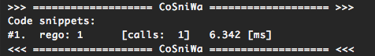

results for C++:

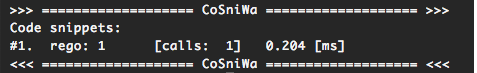

Let's go through the results column by column.

1. The first column (#1) holds an order number of a code snippet.
In this example there is only one code snippet,
which has a '#1' in the first column.
Please note that *Cosniwa* orders code snippets by the total execution time.

2. The second column (rego: 1) holds a registration number ('rego') given to
a code snippet.

3. The third column is empty in this example. It holds a label given to
a code snippet. Look at example3 ('Code registration') below for details.

4. The fourth column ([calls: 1]) holds the number of calls
of a code snippet. In the current example the code was called only once.

5. Finally, the fifth column (Py: 6.342 ms, C++: 0.204 ms) holds
the total execution time of a code snippet.

2.2. Example2: Two code snippets
+++++++++++++++++++++++++++++++++++++++++++++++++++++++++++++++

.. Note::

    Example2 is available on `github.com <https://github.com/jacekpierzchlewski/cosniwa>`_:
    `example2 for Python <https://github.com/jacekpierzchlewski/cosniwa/tree/master/python/examples/example2.py>`_,
    `example2 for C++ <https://github.com/jacekpierzchlewski/cosniwa/tree/master/c++/examples/example2.cpp>`_.

**2.2.1 Adding a second code snippet**

In this example 'add()' function is called one hundred times in a loop.
The 'add()' function inside the loop is a code snippet with registration '1'.

The whole loop is a code snippet with registration '2'.

*Cosniwa* timer for the loop is started in line (Py: 28, C++: 33)
and stopped in line (Py: 33, C++: 40).

.. code-block:: python
   :emphasize-lines: 1
   :lineno-start:  26

    def main():

        csw.call_start(2)   # Start code snippet (loop)
        for inxAdd in range(100):
            csw.call_start(1)    # Start code snippet (add)
            add(1, 100000)
            csw.call_stop(1)     # Stop code snippet (add)
        csw.call_stop(2)   # Stop code snippet (loop)

        # Print the results
        csw.resultc()

.. code-block:: cpp
   :emphasize-lines: 1
   :lineno-start:  28

    int main()
    {
        // Create Cosniwa object
        Cosniwa csw = Cosniwa();

        csw.call_start(2);   // Start code snippet (loop)
        for (int inxAdd = 0 ; inxAdd < 100 ; inxAdd++)
        {
            csw.call_start(1);   // Start code snippet (add)
            add(1, 100000);
            csw.call_stop(1);    // Stop code snippet (add)
        }
        csw.call_stop(2);  // Stop code snippet (loop)

        // Print the results
        csw.resultc();
    }

**2.2.2 Let's time!**

Ok, let’s run example2:

For Python run (in python/examples/):

:code:`$ python3 example2.py`

or for C++ (in c++/examples/):

:code:`$ make example2`  |br|
:code:`$ ./example2`

*Cosniwa*'s output from this example
contains more data than previously.

Results for Python:

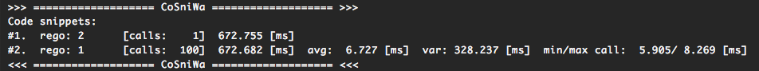

results for C++:

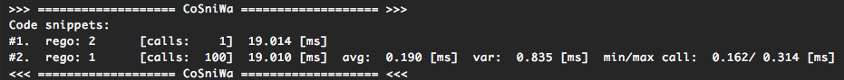

The first line corresponds to the loop (rego 2).

The second line corresponds to the function 'add()' called inside the loop,
let's go through this line column by column.

1. The first column (#2) is an order number
of a code snippet.

2. The second column (rego: 1)
is a registration number of a code snippet.

3. The third column is empty in this example.
It holds labels given to code snippets. Look at example 3 (Code registration) for details.

4. The fourth column ([calls:  100]) holds the number of calls of a code snippet.
The 'add' function was called one hundred times within the loop.

5. The fifth column (Py: 672.682 [ms], C++: 19.010 [ms]) holds the total execution time of a code snippet.
The total execution time of one hundred calls of function 'add()' is 672.682 ms in Python and 19.010 ms in C++.

6. The sixth column (Py: 6.727 [ms], C++: 0.190 [ms]) holds
the average execution time of a code snippet.

7. The seventh column (Py: 328.237 [ms], C++: 0.835 [ms]) holds the variance of execution
times.

8. The last, eigth column (Py: 5.905 / 8.269 [ms], C++: 0.162 / 0.314 [ms]) holds
the minimum and the maximum execution time of a code snippet.

The columns 6th - 8th are printed only for code snippets which are called more than once.

2.3. Example3: Code registration
+++++++++++++++++++++++++++++++++++++++++++++++++++++++++++++++

**2.3.1 Example3A: Static labeling of code snippets**

.. Note::

    Example3A is available on `github.com <https://github.com/jacekpierzchlewski/cosniwa>`_:
    `example3A for Python <https://github.com/jacekpierzchlewski/cosniwa/tree/master/python/examples/example3A.py>`_,
    `example3A for C++ <https://github.com/jacekpierzchlewski/cosniwa/tree/master/c++/examples/example3A.cpp>`_.

Registering time snippets using arbitrarily chosen number may
not be convenient, especially if there are many code snippets to be timed.
*Cosniwa* provides function **reg_code()**
which can be used to label a code snippet and automatically
assign a registration number.

Look at the examples below.
Two code snippets are registered using **reg_code()** function
(Py: lines 29 and 30, C++: lines 34 and 35).

.. code-block:: python
   :emphasize-lines: 1
   :lineno-start:  26

    def main():

        # Register the code snippets
        iRego1 = csw.reg_code("add")
        iRego2 = csw.reg_code("100 x add")

.. code-block:: cpp
   :emphasize-lines: 1
   :lineno-start:  28

    int main()
    {
        // Create Cosniwa object
        Cosniwa csw = Cosniwa();

        // Register code snippets
        unsigned int iRego1 = csw.reg_code("add");
        unsigned int iRego2 = csw.reg_code("100 x add");

The returned values (iRego1, iRego2) are then used
in functions **call_start()** and **call_stop()**.

.. code-block:: python
   :emphasize-lines: 1
   :lineno-start:  32

    csw.call_start(iRego2)    # Start code snippet (loop)
    for inxAdd in range(100):
        csw.call_start(iRego1)    # Start code snippet (add)
        add(1, 100000)
        csw.call_stop(iRego1)     # Stop code snippet (add)
    csw.call_stop(iRego2)    # Stop code snippet (loop)

    # Print the results
    csw.resultc()

.. code-block:: cpp
   :emphasize-lines: 1
   :lineno-start:  37

        csw.call_start(iRego2);   // Start code snippet (loop)
        for (int inxAdd = 0 ; inxAdd < 100 ; inxAdd++)
        {
            csw.call_start(iRego1);   // Start code snippet (add)
            add(1, 100000);
            csw.call_stop(iRego1);    // Stop code snippet (add)
        }
        csw.call_stop(iRego2);  // Stop code snippet (loop)

**2.3.2 Let's time!**

Let’s run example3A.

For Python run (in python/examples/):

:code:`$ python3 example3A.py`

or for C++ (in c++/examples/):

:code:`$ make example3A`  |br|
:code:`$ ./example3A`

*Cosniwa*'s outputs in this example are similiar to
results from the previous example.

Timing results for Python:

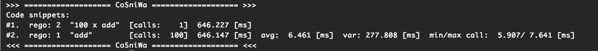

results for C++:

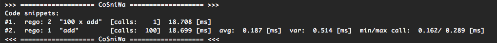

The main difference is the third column.
It contains labels ("100 x add", "add") given to the code.

**2.3.3 Example3B: Dynamic labeling of code snippets**

.. Note::

    Example3B is available on `github.com <https://github.com/jacekpierzchlewski/cosniwa>`_:
    `example3B for Python <https://github.com/jacekpierzchlewski/cosniwa/tree/master/python/examples/example3B.py>`_,
    `example3B for C++ <https://github.com/jacekpierzchlewski/cosniwa/tree/master/c++/examples/example3B.cpp>`_.

It is possible to use **reg_code()** directly in functions
**call_start()** and **call_stop()** as in the examples below:

.. code-block:: python
   :emphasize-lines: 1
   :lineno-start:  26

    def main():

        csw.call_start(csw.reg_code("100 x add"))  # Start code snippet (loop)
        for inxAdd in range(100):
            csw.call_start(csw.reg_code("add"))    # Start code snippet (add)
            add(1, 100000)
            csw.call_stop(csw.reg_code("add"))     # Stop code snippet (add)
        csw.call_stop(csw.reg_code("100 x add"))   # Stop code snippet (loop)

        # Print the results
        csw.resultc()

.. code-block:: cpp
   :emphasize-lines: 1
   :lineno-start:  28

    int main()
    {
        // Create Cosniwa object
        Cosniwa csw = Cosniwa();

        csw.call_start(csw.reg_code("100 x add"));  // Start code snippet (loop)
        for (int inxAdd = 0 ; inxAdd < 100 ; inxAdd++)
        {
            csw.call_start(csw.reg_code("add"));    // Start code snippet (add)
            add(1, 100000);
            csw.call_stop(csw.reg_code("add"));     // Stop code snippet (add)
        }
        csw.call_stop(csw.reg_code("100 x add"));   // Stop code snippet (loop)

        // Print the results
        csw.resultc();
    }

Let’s run example 3B.

For Python run (in python/examples/):

:code:`$ python3 example3B.py`

or for C++ (in c++/examples/):

:code:`$ make example3B`  |br|
:code:`$ ./example3B`

Results for Python:

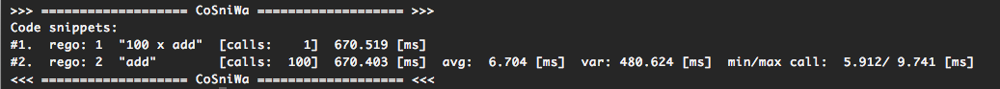

results for C++:

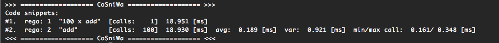

The results are similar to the previous example,
however, the timing results will be affected a bit by
function **reg_code()** which is called before calling
**call_stop()** function.

.. note::
    In Cosniwa 1.1 this disadvantage will be removed, and dynamic labeling
    will have no effect on timing.

2.4. Example4: Add main time
+++++++++++++++++++++++++++++++++++++++++++++++++++++++++++++++

.. Note::

    Example4 is available on `github.com <https://github.com/jacekpierzchlewski/cosniwa>`_:
    `example4 for Python <https://github.com/jacekpierzchlewski/cosniwa/tree/master/python/examples/example4.py>`_,
    `example4 for C++ <https://github.com/jacekpierzchlewski/cosniwa/tree/master/c++/examples/example4.cpp>`_.

*Cosniwa* provides two functions **start()**
and **stop()** which can be used to start and stop
the main timer in *Cosniwa*.

Take a look at the examples below.
Four code snippets are registered:

.. code-block:: python
   :emphasize-lines: 1
   :lineno-start:  29

    # Register the code snippets
    iRego1 = csw.reg_code("add(1, 100000)")
    iRego2 = csw.reg_code("100 x add(1, 100000)")
    iRego3 = csw.reg_code("add(1, 10000)")
    iRego4 = csw.reg_code("100 x add(1, 10000)")

.. code-block:: cpp
   :emphasize-lines: 1
   :lineno-start:  33

    // Register the code snippets
    unsigned int iRego1 = csw.reg_code("add(1, 100000)");
    unsigned int iRego2 = csw.reg_code("100 x add(1, 100000)");
    unsigned int iRego3 = csw.reg_code("add(1, 10000)");
    unsigned int iRego4 = csw.reg_code("100 x add(1, 10000)");

Two loops are timed in the example below.

Before the loops the **start()**
function is called (Py: line 36, C++ line 40),
after the loops the **stop()** function is called (Py: line 53, C++ line 61).

Code between these function is called 'main code'.

.. code-block:: python
   :emphasize-lines: 1
   :lineno-start:  35

    # Start the main CoSniWa time
    csw.start()

    csw.call_start(iRego2)   # Start loop 100 x add(1, 100000)
    for inxAdd in range(100):
        csw.call_start(iRego1)   # Start code snippet (add(1, 100000))
        add(1, 100000)
        csw.call_stop(iRego1)    # Stop code snippet (add(1, 100000))
    csw.call_stop(iRego2)  # Stop loop 100 x add(1, 100000)

    csw.call_start(iRego4)   # Start loop 100 x add(1, 10000)
    for inxAdd in range(100):
        csw.call_start(iRego3)   # Start code snippet (add(1, 10000))
        add(1, 10000)
        csw.call_stop(iRego3)    # Stop code snippet (add(1, 10000))
    csw.call_stop(iRego4)  # Stop loop 100 x add(1, 10000)

    # Stop the main CoSniWa time
    csw.stop()

.. code-block:: cpp
   :emphasize-lines: 1
   :lineno-start:  39

    // Start the main CoSniWa time
    csw.start();

    csw.call_start(iRego2);   // Start loop 100 x add(1, 100000)
    for (int inxAdd = 0 ; inxAdd < 100 ; inxAdd++)
    {
        csw.call_start(iRego1);   // Start code snippet (add(1, 100000))
        add(1, 100000);
        csw.call_stop(iRego1);    // Stop code snippet (add(1, 100000))
    }
    csw.call_stop(iRego2);   // Stop loop 100 x add(1, 100000)

    csw.call_start(iRego4);   // Start loop 100 x add(1, 10000)
    for (int inxAdd = 0 ; inxAdd < 100 ; inxAdd++)
    {
        csw.call_start(iRego3);   // Start code snippet (add(1, 10000))
        add(1, 10000);
        csw.call_stop(iRego3);    // Stop code snippet (add(1, 10000))
    }
    csw.call_stop(iRego4);  // Stop loop 100 x add(1, 10000)

    // Stop the main CoSniWa time
    csw.stop();

Hence to these functions, more data is added to *Cosniwa*'s output.

Let’s run example 4.

For Python run (in python/examples/):

:code:`$ python3 example4.py`

or for C++ (in c++/examples/):

:code:`$ make example4`  |br|
:code:`$ ./example4`

Results for Python:

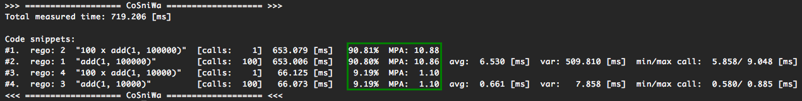

results for C++:

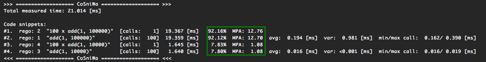

There first visible difference comparing to the previous examples is the
'Total measured time' printed just after *Cosniwa*'s header.
It gives the time measured between **start()** and **stop()**
functions, which is called 'main time'.

Furthermore, there are two new columns int the *Cosniwa*'s output.
The columns are between the total execution time and
average execution time (marked with a green rectangle).

The first new column is the column with percentage (%) at the end of the number.
It compares the total execution time of a code snippet with the main time.
For example, loop which calls 'add(1, 100000)' function
takes 90.81% of the main time (719.206 ms) in Python,
and 92.16 % of the main time (21.014 ms) in C++.

The second column which was not present in the previous examples is
the column which starts with 'MPA'.
The three letters acronym 'MPA' means 'maximum possible acceleration'.

Value in this column gives information about how much
execution of main code
would be accelerated if a code snippet corresponding to the column would
be executed in no time.

2.5. Example5:  Using Cosniwa with classes
+++++++++++++++++++++++++++++++++++++++++++++++++++++++++++++++

**2.5.1 Example 5A:  Let's time ten code snippets**

.. Note::

    Example5A is available on `github.com <https://github.com/jacekpierzchlewski/cosniwa>`_:
    `example5A for Python <https://github.com/jacekpierzchlewski/cosniwa/tree/master/python/examples/example5A.py>`_,
    `example5A for C++ <https://github.com/jacekpierzchlewski/cosniwa/tree/master/c++/examples/example5A.cpp>`_.

*Cosniwa* is a tool dedicated to profiling
multi-object and multi-language code (C++ and Python).
This example shows how to use *Cosniwa* with objects.

To use *Cosniwa* in C++, a *Cosniwa* object must be created:

.. code-block:: cpp
   :emphasize-lines: 1
   :lineno-start:  110

        // Create Cosniwa object
        Cosniwa csw = Cosniwa();

Then a handle (address) of *Cosniwa* object can be propagated
to other objects which use *Cosniwa*.

In Python this is not the case, since *Cosniwa*'s functions are used
directly from the module.
So to give a handle of *Cosniwa* to other objects
the handle must be obtained.

Function **get_handle()** returns a handle to *Cosniwa*:

.. code-block:: python
   :emphasize-lines: 1
   :lineno-start:  83

    def main():

        # Get handle to Cosniwa module
        hCsw = csw.get_handle()

In the current example (example5A) a 'Fibonacci' class is used.
It is a class which computes n-th element of the Fibonacci sequence.

Initialisation method (Python) and constructor (C++) of the class are below:

.. code-block:: python
   :emphasize-lines: 1
   :lineno-start:  18

    class Fibonacci():
        """
        'Fibonacci': Class which computes n-th element
                     of the Fibonacci sequence.
        """

        def __init__(self, iIndex_, Cosniwa_):
            """
            INITIALISATION METHOD.

            Arguments:
              iIndex_:   [int]             Index of a class
              Cosniwa_:  [Cosniwa handle]  Handle to Cosniwa object

            """

            # Store the index of the class and the handle to Cosniwa
            self.iIndex = iIndex_
            self.hCsw = Cosniwa_

            # Create a class name
            self.strName = 'Fibonacci #%d' % self.iIndex

            # Register the class in Cosniwa
            self.iCswReg = csw.xreg_code(self.hCsw, self.strName)

.. code-block:: cpp
   :emphasize-lines: 1
   :lineno-start:  36

    Fibonacci::Fibonacci(int iIndex_, Cosniwa* csw_)
    {
    /*
     *  CONSTRUCTOR.
     *
     *  Parameters:
     *   iIndex_:  [int]       Index of a class
     *   csw_:     [Cosniwa*]  Pointer to Cosniwa object
     *
     */

        // Store the index of the class and the pointer to Cosniwa
        iIndex = iIndex_;
        csw = csw_;

        // Create a class name
        std::stringstream streamIndex;
        streamIndex << iIndex_;
        strName = "Fibonacci #" + streamIndex.str();

        // Regsiter the class in Cosniwa
        iCSWRego = csw->reg_code(strName);
    }

There are are two arguments which must be given to a created 'Fibonacci'
object: index of the new object and a handle to Cosniwa object.

The newly generated object stores these arguments
(Python: lines 35, 36, C++: lines 48, 49),
generates a new object name (Python: line 39, C++: lines 52-54),
and registers itself in Cosniwa (Python: line 42, C++: line 57).

Cosniwa is used by 'Fibonacci' class in 'run()' function which
computes n-th element of the Fibonacci sequence:

.. code-block:: python
   :emphasize-lines: 1
   :lineno-start:  44

    def run(self, iNEl):
        """
        run:  COMPUTE THE n-TH ELEMENT OF THE FIBONACCI SEQUENCE.

         Function computes the n-th element of the Fibonacci sequence by
         iterating through all the sequence until n-th elements.
         It is preassumed that the 1st (index 0) and the 2nd (index 1)
         elements of the sequence equal 1.

          Arguments:
            iNLen:  [int]  Index of the element to be computed

          Returns:
            iFibo:  [int]  n-th element of the Fibonacci sequence
        """

        iFibo = 1
        iFiboPrev = 1
        iFiboPrevPrev = 1

        # Start the Cosniwa stopwatch
        csw.xcall_start(self.hCsw, self.iCswReg)

        # 1st and 2nd element equals 1
        if (iNEl < 2):
            return 1

        # Loop unitl n-th element
        for inxFib in range(iNEl - 2):
            iFiboPrevPrev = iFiboPrev
            iFiboPrev = iFibo
            iFibo = iFiboPrev + iFiboPrevPrev

        # Stop the Cosniwa stopwatch
        csw.xcall_stop(self.hCsw, self.iCswReg)

        return iFibo

.. code-block:: cpp
   :emphasize-lines: 1
   :lineno-start:  61

    long unsigned int Fibonacci::run(unsigned int iNLen)
    {
    /*
     *  run:  COMPUTE THE n-TH ELEMENT OF THE FIBONACCI SEQUENCE.
     *
     *  Function computes the n-th element of the Fibonacci sequence by
     *  iterating through all the sequence until n-th elements.
     *  It is preassumed that the 1st (index 0) and the 2nd (index 1) elements of
     *  the sequence equal 1.
     *
     *  Parameters:
     *   iNLen:  [unsigned int]  Index of the element to be computed
     *
     *  Returns:
     *   iFibo:  [long unsigned int]  n-th element of the Fibonacci sequence
     *
     */

        long unsigned int iFibo = 1;
        long unsigned int iFiboPrev = 1;
        long unsigned int iFiboPrevPrev = 1;

        // Start the Cosniwa stopwatch
        csw->call_start(iCSWRego);

        // 1st and 2nd element equals 1
        if (iNLen < 2)
        {
            return 1;
        }

        // Loop unitl n-th elements
        for (int inxFib=0 ; inxFib < (iNLen - 2) ; inxFib++)
        {
            iFiboPrevPrev = iFiboPrev;
            iFiboPrev = iFibo;

            iFibo = iFiboPrev + iFiboPrevPrev;
        }

        // Stop the Cosniwa stopwatch
        csw->call_stop(iCSWRego);

        return iFibo;
    }

Observe that *Cosniwa* is used very differently in Python and in C++.

In C++, functions **call_start()** and **call_stop()**
are simply called as member classes of an object pointed by 'csw' pointer
(C++: lines 84, 102).

In Python, functions **xcall_start()** and **xcall_stop()** are used
(Py: lines 65, 78).
These functions are provided by *Cosniwa* module (cCosniwa),
letter 'x' at the beginning comes from 'eXternal'.

Purpose of functions **xcall_start()** and **xcall_stop()**
is to run **call_start()**
and **call_stop()** with external *Cosniwa* using a handle.
The first argument is a handle to an external *Cosniwa*.

There are more 'x' functions provided by Python *Cosniwa* module (cCosniwa).
First argument of all these functions is a handle to an
external *Cosniwa*.
Take a look at **List of functions** below for more details.

Below are the 'main()' functions of the example for Python and C++:

.. code-block:: python
   :emphasize-lines: 1
   :lineno-start:  83

    def main():

        # Get handle to Cosniwa module
        hCsw = csw.get_handle()

        # Start the main CoSniWa time
        csw.start()

        # Generate 10 Fibonacci classes
        f0 = Fibonacci(0, hCsw)
        f1 = Fibonacci(1, hCsw)
        f2 = Fibonacci(2, hCsw)
        f3 = Fibonacci(3, hCsw)
        f4 = Fibonacci(4, hCsw)
        f5 = Fibonacci(5, hCsw)
        f6 = Fibonacci(6, hCsw)
        f7 = Fibonacci(7, hCsw)
        f8 = Fibonacci(8, hCsw)
        f9 = Fibonacci(9, hCsw)

        # Compute Fibonacci sequences with different number of elements
        f0.run(100000)
        f1.run(90000)
        f2.run(80000)
        f3.run(70000)
        f4.run(60000)
        f5.run(50000)
        f6.run(40000)
        f7.run(30000)
        f8.run(20000)
        f9.run(1000)

        # Stop the main CoSniWa time
        csw.stop()

        # Print out the timing results
        csw.resultc()

.. code-block:: cpp
   :emphasize-lines: 1
   :lineno-start:  108

    int main()
    {
        // Create Cosniwa object
        Cosniwa csw = Cosniwa();

        // Start the main CoSniWa time
        csw.start();

        // Define 10 Fibonacci classes with indices from 0 to 9
        Fibonacci f0(0, &csw);
        Fibonacci f1(1, &csw);
        Fibonacci f2(2, &csw);
        Fibonacci f3(3, &csw);
        Fibonacci f4(4, &csw);
        Fibonacci f5(5, &csw);
        Fibonacci f6(6, &csw);
        Fibonacci f7(7, &csw);
        Fibonacci f8(8, &csw);
        Fibonacci f9(9, &csw);

        // Compute Fibonacci sequences with different number of elements
        f0.run(100000);
        f1.run(90000);
        f2.run(80000);
        f3.run(70000);
        f4.run(60000);
        f5.run(50000);
        f6.run(40000);
        f7.run(30000);
        f8.run(20000);
        f9.run(1000);

        // Stop the main CoSniWa time
        csw.stop();

        // Print out the timing results
        csw.resultc();
    }

If you are familiar with Python and/or C++,
and studied previous examples,
these functions do not require a lot of explanation.

Ten Fibonacci objects are created with different indices
(Py: lines 92 - 101, C++: lines 117 - 126).

Then, run() function is called for all the objects,
(Py: lines 104 - 113, C++: lines 129 - 138)
with different argument (requested element of the Fibonacci sequence).

Please note that the main time is also timed
(Py: lines 89, 116, C++: lines 114, 141).

Let's run this example and see the results.

For Python run (in python/examples/):

:code:`$ python3 example5A.py`

or for C++ (in c++/examples/):

:code:`$ make example5A`  |br|
:code:`$ ./example5A`

Results for Python:

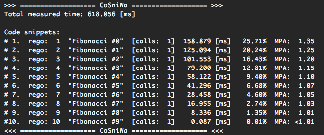

results for C++:

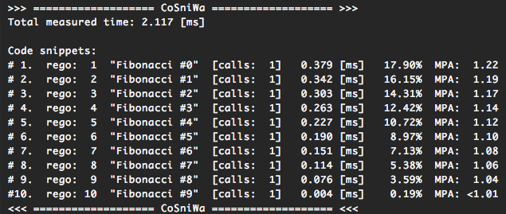

The above results are as expected.
Every object was registered as a separated code snippet,
so in the above timing results there are ten different code snippets timed.

**2.5.2 Example 5B:  Let's time classes together**

.. Note::

    Example5B is available on `github.com <https://github.com/jacekpierzchlewski/cosniwa>`_:
    `example5B for Python <https://github.com/jacekpierzchlewski/cosniwa/tree/master/python/examples/example5B.py>`_,
    `example5B for C++ <https://github.com/jacekpierzchlewski/cosniwa/tree/master/c++/examples/example5B.cpp>`_.

This example differs a bit from the previous one.
All the objects are registered in *Cosniwa* with the same name,
because index of 'Fibonacci' object is not added to the name of the object.

Part of the code which is different than in the previous example (example5A)
is below:

.. code-block:: python
   :emphasize-lines: 1
   :lineno-start:  38

        # Create a class name
        self.strName = 'Fibonacci'

        # Register the class in Cosniwa
        self.iCswReg = csw.xreg_code(self.hCsw, self.strName)

.. code-block:: cpp
   :emphasize-lines: 1
   :lineno-start:  51

        // Create a class name
        strName = "Fibonacci";

        // Regsiter the class in Cosniwa
        iCSWRego = csw->reg_code(strName);

Let's run this example and see the results.

For Python run (in python/examples/):

:code:`$ python3 example5B.py`

or for C++ (in c++/examples/):

:code:`$ make example5B`  |br|
:code:`$ ./example5B`

Results for Python:

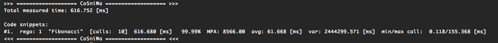

results for C++:

.. image:: images/example5Bcpp.png

Since all the objects were registered with the same label,
all the 'run()' functions are treated as one code snippet.
Therefore, there is only one code snippet in the
timing results.

